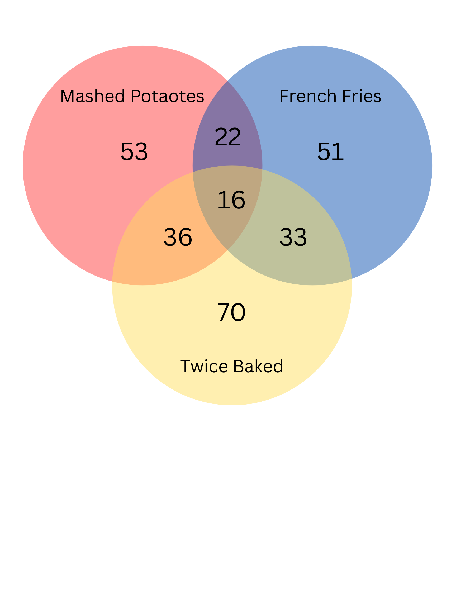
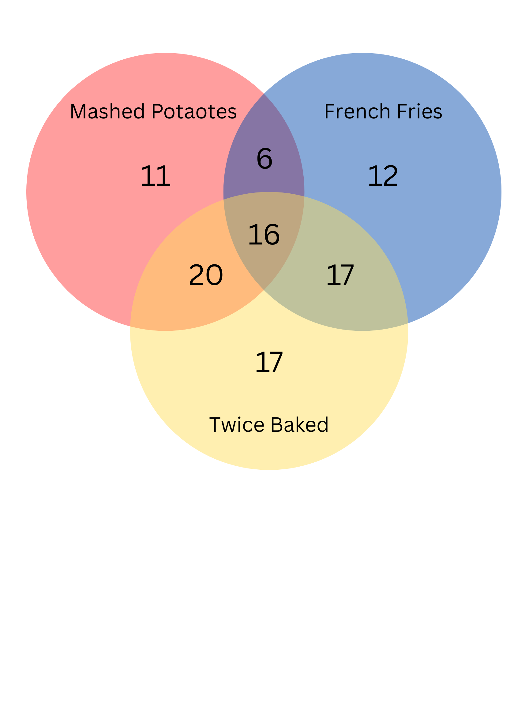

# Practice Problems 4 & 5 
## Anupama and Yuri

## Question 4
In a recent survey, 115 students reported whether they liked their potatoes mashed, French-fried, or twice-baked. 53 liked them mashed, 51 liked French fries, and 70 liked twice baked potatoes. Additionally, 22 students liked both mashed and French-fried potatoes, 33 liked French fries and twice baked potatoes, 36 liked mashed and baked, and 16 liked all three styles. How many students hate potatoes? Explain why your answer is correct.

The values can be represented like:

$mashed = 53$  
$french = 51$  
$baked = 70$  
$mashed \cap french = 22$  
$baked \cap mashed = 36$  
$french \cap baked = 33$
$french \cap baked \cap mashed = 16$

In the textbook it shows us that we can visually solve this by creating a venndigram. The vendiagram above is with its orginal values.

To get this diagram you would have to put $french \cap baked \cap mashed = 16$ first then you would put $french \cap baked = 33$ - $french \cap baked \cap mashed = 16$. You would contiune to fill out the vendiagram like this. Then when you add them all up we get 99. This tells us that 99 people liked some sort of potatoe. When we do the orginal amount of people who voted - the people who liked potatoes, 115-99 we get 16. 16 people hate potatoes.

A easier way to do it is:
$mashed + french + baked - mashed \cap french - baked \cap mashed - french \cap baked + french \cap baked \cap mashed$
$53 - 51 - 70 - 22 - 36 - 33 + 16 = 99$

$115 - 99 = 16$

16 people hate potatoes

## Question 5
How many 14 bit strings (that is, bit strings of length 14) are there which:

a. Start with the sub-string 011?

**Answer:**

$2^{11} = 2048$

**Why**
- The first 3 bits are fixed as 011
- That leaves 14-3 = 11 bits to choose freely
- Each of thoes 11 bits can be wither 0 or 1 -> total number of strings:

b. Have weight 8 (i.e., contain exactly 8 1’s) and start with the sub-string 011?

**Answer:**

$\binom{11}{6} = 462$

**Why**
- Fixed prefix: 011 → 2 ones already in the prefix.
- So we need 6 more 1’s in the remaining 11 bits (from part a).
- Choose 6 positions for 1’s among the 11:

c.How many 14-bit strings either start with 011 or end with 01 (or both)?

**Answer:**

$5632$

**Why**

First use inclusion-exclusion:

- Start with 011: 11 remaining bits → 2^{11} = 2048
- End with 01: 12 bits before the suffix → 2^{12} = 4096
- Start with 011 AND end with 01: Fix 3 bits at start and 2 at end → 9 bits in the middle →
$2^9 = 512$
Now apply inclusion-exclusion:
$2048 + 4096 - 512 = 5632$

d. How many 14-bit strings have weight 8 and either start with 011 or end with
01 (or both)?

**Answer:**

$1128$

**Why**

First we have to apply inclusion-exclusion with combinations:

- $A = Strings with weight 8 and start with 011$
- $B = Strings with weight 8 and end with 01$
- $A \cap B = Strings with weight 8 and start with 011 and end with 01$

From question b we got:
$A: We calculated this in (b) → \binom{11}{6} = 462$

Now to calculate:
- B: Ending with 01 means last 2 bits fixed, 12 bits left.
    - Need 8 total 1s, but 0 in position 13 and 1 in position 14 → 1 bit is already 1
    - $Need 7 more 1’s in 12 remaining bits → \binom{12}{7} = 792$
- $A \cap B: Fixed first 3 (011) and last 2 (01) → 9 middle bits$
    - From fixed bits: 2 ones in prefix and 1 in suffix → 3 ones total
    - $Need 5 more 1’s from 9 bits → \binom{9}{5} = 126$

Then use inclusion-exclusion:
$462 + 792 - 126 = 1128$